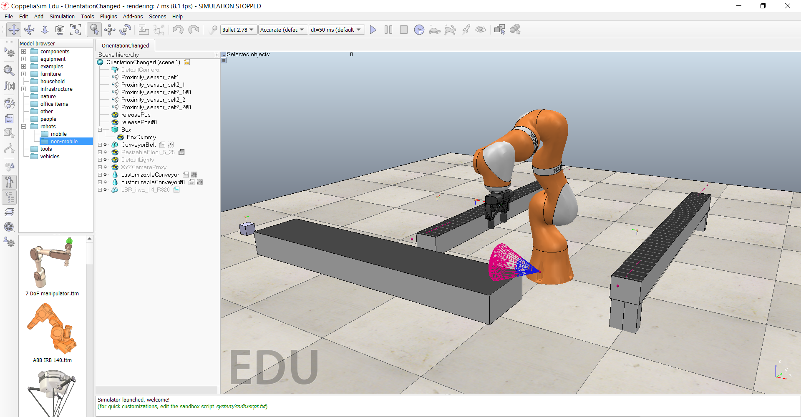
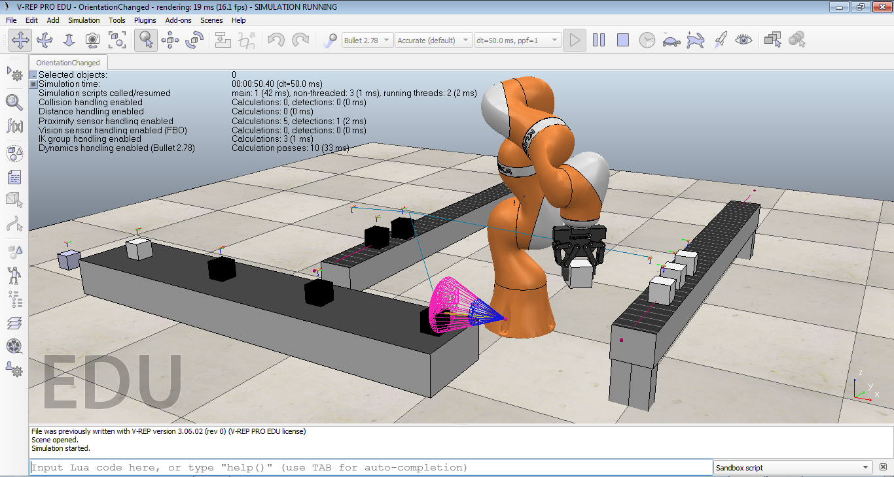

# Pick and Place Bot in V-REP  
V-REP scene to simulate a robot which picks up black and white boxes from one conveyor and places them on separate conveyors  


<!-- TABLE OF CONTENTS -->
## Table of Contents

* [About the Project](#about-the-project)
  * [Tech Stack](#tech-stack)
  * [File Structure](#file-structure)
* [Getting Started](#getting-started)
  * [Prerequisites](#prerequisites)
  * [Installation](#installation)
* [Usage](#usage)
* [Results and Demo](#results-and-demo)
* [Future Work](#future-work)
* [Troubleshooting](#troubleshooting)
* [Contributors](#contributors)
* [Acknowledgements and Resources](#acknowledgements-and-resources)
* [License](#license)


<!-- ABOUT THE PROJECT -->
## About The Project
  

The aim of the project is to simulate a robotic arm which picks up white and black boxes from a conveyor and places them on separate conveyors. This is accomplished with the use of inverse kinematics and path planning. In this project, we have used a KUKA robot which is already inbuilt in CoppeliaSim/V-REP software.   
Refer this [documentation](https://link/to/report/).

### Tech Stack
Software used for this project :  
   [V-REP/CoppeliaSim (specifically, V-REP PRO EDU 3.6.2 version has been used)](https://www.coppeliarobotics.com/)

### File Structure
    .
    ├── PickAndPlace.ttt        # Project file - Open it in V-REP and start the simulation
    ├── WithoutDepth            # Future work - Extracting X and Z coordinates of boxes
    ├── WithDepth               # Future work - Extracting X, Y and Z coordinates of boxes
    ├── report.pdf              # Project report
    ├── LICENSE
    └── README.md  
    

<!-- GETTING STARTED -->
## Getting Started

### Prerequisites

 CoppeliaSim/V-REP

  You can visit the [Coppelia Robotics website](https://www.coppeliarobotics.com/previousVersions) for the installation. We have used V-REP PRO EDU Version 3.6.2 for our project.
  

### Installation
Clone the repo
```sh
git clone https://github.com/Tejal-19/simbotix.git
```

<!-- USAGE EXAMPLES -->
## Usage
```
Open PickAndPlace.ttt in V-REP and start the simulation.
```


<!-- RESULTS AND DEMO -->
## Results and Demo
Scene before starting the simulation:  
  
  
  
Scene during the simulation:  
  
  
  
  
[**Video of Final Scene**](https://youtu.be/Pa8bjl16Gbc)  


<!-- FUTURE WORK -->
## Future Work
* Extracting coordinates of white boxes
- [x] Add Vision Sensor
- [x] Add Blob Detection Filter
- [ ] Add Vision Sensor script
- [ ] Convert all coordinates to metres  
* Other possible modifications:
- [ ] Adding camera/vision sensors to detect object
- [ ] Changing the robot and gripper, or designing one
- [ ] Make the robot mobile
- [ ] Obstacle avoidance and end-to-end planning

<!-- TROUBLESHOOTING -->
## Troubleshooting
* The robotic arm moves erratically  
  Change position of target dummy. If that doesn't work, adjust the pos angles.
* The arm does not follow the path  
  Make sure all the joints are set to Inverse Kinematics mode. Also check the code to see whether path is created correctly.
* Gripper does not work  
  Disable or delete the default script of the gripper and replace it with the one used in PickAndPlace.ttt.
  


<!-- CONTRIBUTORS -->
## Contributors

* MENTORS
  1. Ms. Priti Jain: dodotitu768@gmail.com
  2. Mr. Manas Thorat: manasthorat09@gmail.com
* MEMBERS
  1. [Ms. Tejal Bedmutha](https://github.com/Tejal-19) : tezzb18@gmail.com
  2. [Ms. Reshmika Sreenath Nambiar](https://github.com/Reshmika-Nambiar) : reshmikasnambiar@gmail.com

<!-- ACKNOWLEDGEMENTS AND REFERENCES -->
## Acknowledgements and Resources
* [SRA VJTI](http://sra.vjti.info/) Eklavya 2020   
* IEEE research papers
* [Inverse Kinematics tutorial](https://youtu.be/JUiSZinyH1c)


<!-- LICENSE -->
## License
  MIT License  
  
  Copyright (c) 2020 Tejal Bedmutha and Reshmika Nambiar  
  Go to [License](LICENSE) for full license. 
